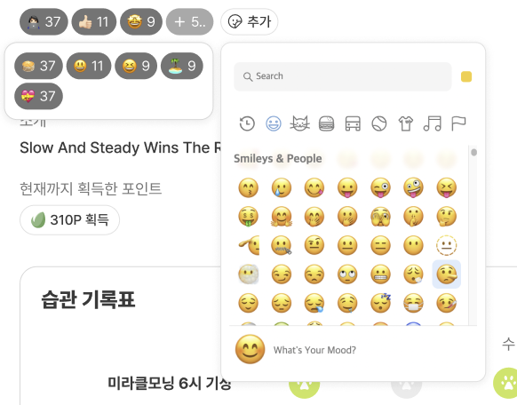
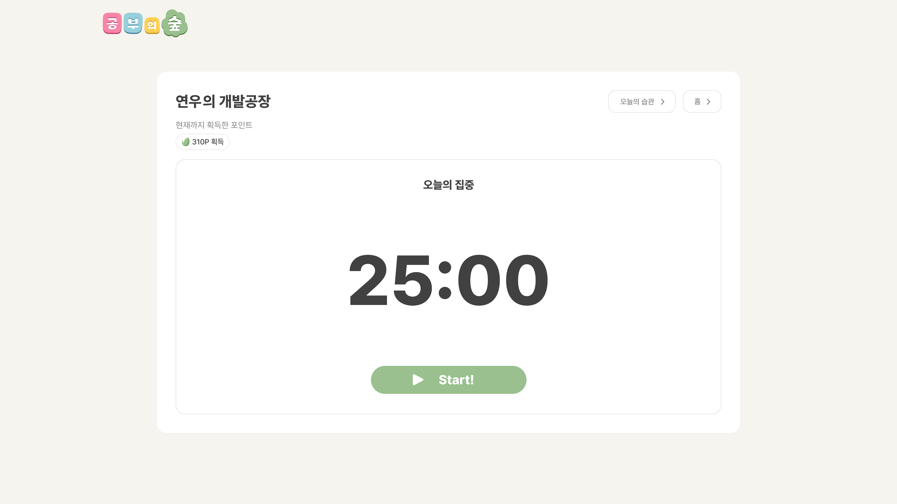
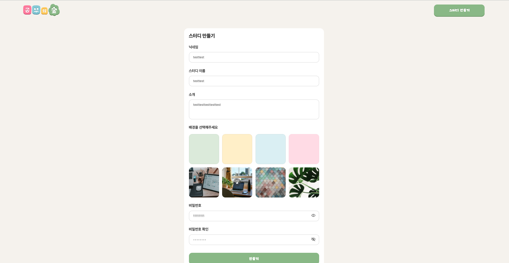
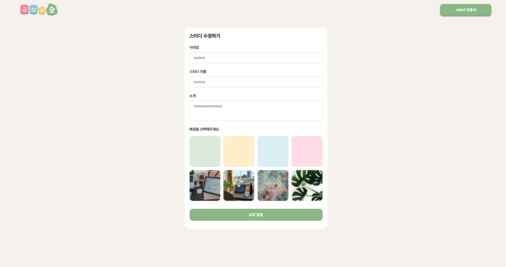
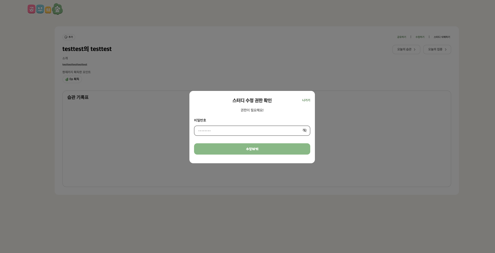
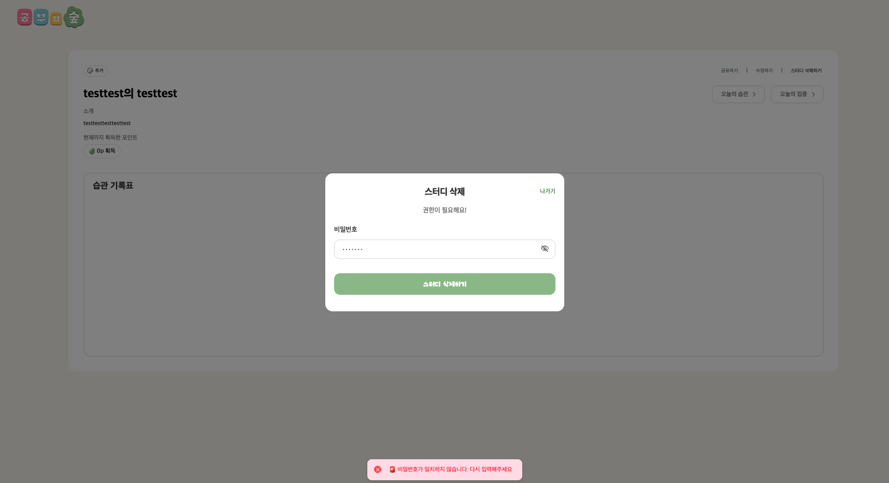
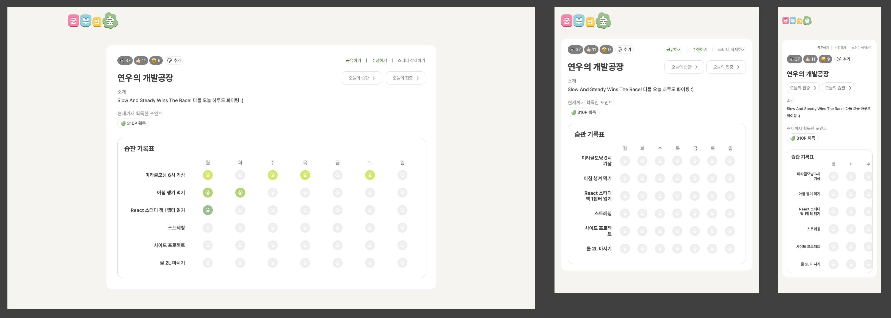
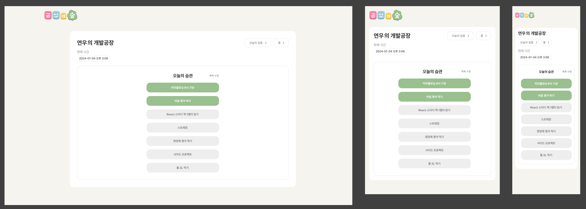
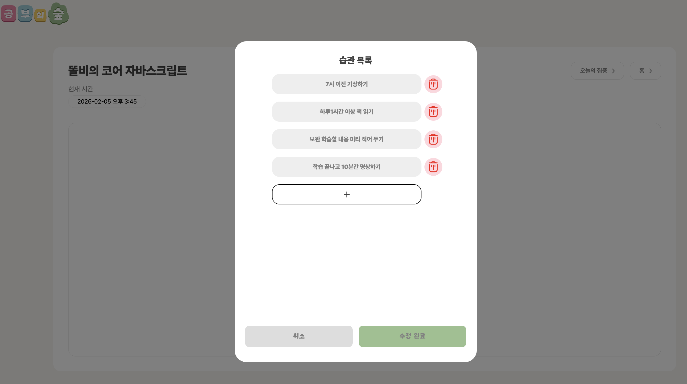
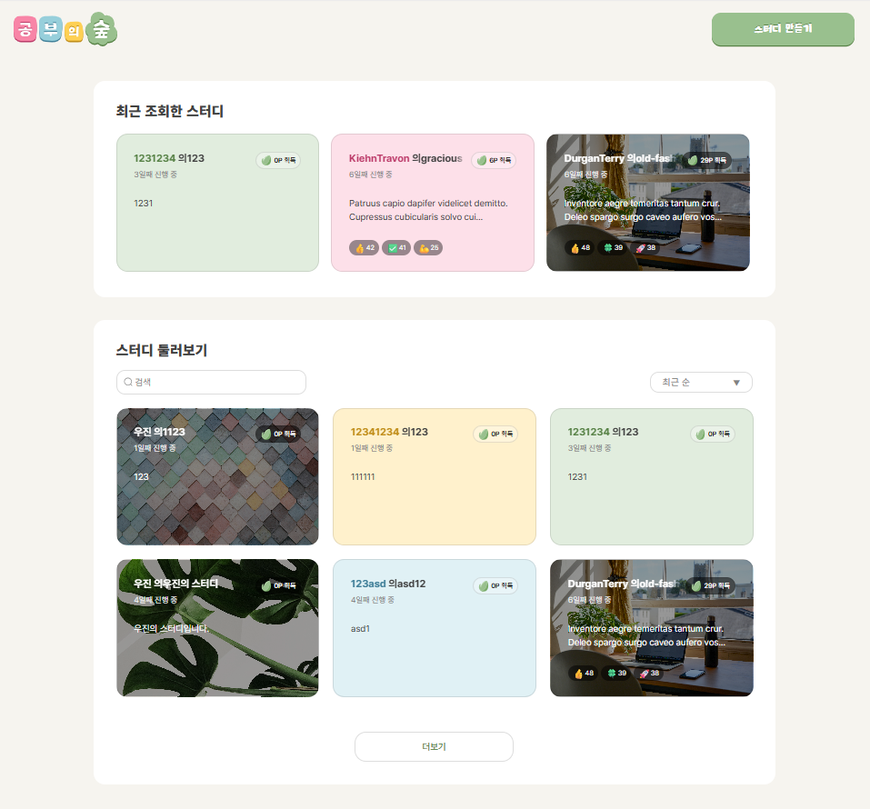

# 🔥 Fire404
(팀 협업 문서 링크 게시)

## 팀원 구성
- 백은결(https://github.com/eungyeolbaek)

- 박도담(https://github.com/crayonpeenut)

- 박수훈(https://github.com/mdeeno)

- 윤숙희(https://github.com/zoeyoon90)

- 이석우(https://github.com/dolby527)

- 최우진(https://github.com/DevWoojin97)


## 프로젝트 소개
### 공부의 숲
- 개인 공부 관리 및 커뮤니티 서비스
- 프로젝트 기간: 2026.01.20 ~ 2026.02.06

<br>

## 기술 스택
### 🎨 Frontend


---

### 🖥 Backend


---

### 🗄 Database


---

### 🔧 Tools & Collaboration


---

### 🚀 Deployment


<br>

## 팀원별 구현 기능 상세
### 백은결
<p align="center">
  
</p>

<br>

- 프로젝트 리딩 및 협업 관리
  - 팀장으로서 프론트엔드·백엔드 초기 구조 설계 및 개발 환경 세팅
  - GitHub 레포지토리 및 브랜치 전략 수립, 코드 리뷰를 통한 품질 관리
  - Prisma Schema 설계 논의 주도 및 Seed 데이터 구성
- 공통 기능 및 UI 구현
  - Link 기반 공통 이동 컴포넌트 구현
  - 응원 이모지 컴포넌트 및 관련 API 일부 구현
  - 이모지 클릭 시 증가/취소가 가능한 토글 UX로 개선
- 기능 개선 및 이슈 해결
  - 데스크탑 환경에서의 가로 스크롤 UX 이슈를 인지하고 개선 방향 제안
  - 스터디 삭제 시 연관 Habit 데이터로 인한 삭제 실패 문제 해결
  (Prisma onDelete: Cascade 적용)

<br><br>

### 박도담
<p align="center">
  
</p>

<br>

- 오늘의 집중(Focus) 풀스택 구현
  - RESTful API(GET, POST) 및 프론트엔드 연동으로 포인트 보상 로직, 이모지 구현
  - 타이머의 재생, 일시정지, 리셋 기능과 카운트다운, 초과시간 안내 구현
  - 반응형 레이아웃 구현
- 사용자 경험(UX) 최적화
  - 포인트 적립 API에 직관적인 명칭 부여 및 코드 압축
  - isSuccess를 이용한 미션 성공/ 실패 기록 명징화
  - 에러메세지 직관적 해석이 가능하도록 수정

<br><br>

### 박수훈
<p align="center">
  
  
  
  
</p>

<br>

- 스터디 관리(CRUD) 풀스택 구현
  - RESTful API(GET, POST, PATCH, DELETE) 및 프론트엔드 연동으로 생성·조회·수정·삭제 기능 완성
  - 데이터 무결성을 위한 백엔드 유효성 검사(Validation) 및 에러 핸들링 미들웨어 적용
  - 반응형 레이아웃 구현
- 보안 및 사용자 경험(UX) 최적화
  - 공용으로 사용할 PasswordModal, GlobalToster 컴포넌트 구현
  - 비밀번호 인증 모달을 통한 스터디 수정/삭제 권한 제어 시스템 구현

<br><br>

### 윤숙희

<p align="center">
  
  
</p>

<br>

[Frontend 주요 작업]
- 오늘의 습관 페이지 구현 (HabitPage.jsx)
  - 실시간 디지털 시계 컴포넌트 (10초 간격 업데이트)
  - 습관 리스트 렌더링 및 상태 관리
- 습관 토글 인터랙션 (DailyHabit.jsx)
  - 체크박스 클릭 시 habitRecord에 checkDate 추가/삭제
  - Optimistic Update 적용 (즉각적인 UI 반영)
  - 새로고침 시에도 체크 상태 유지
- 스터디 상세 페이지 (StudyDetailPage.jsx)
  - 스터디 정보 및 포인트 표시
  - 주간 습관 기록표 UI 구현 (HabitRecord.jsx, HabitRecordRow.jsx) [석우님 협어
  - 페이지 진입 시 비밀번호 모달 통합 [수훈님 협업]
- 상세 페이지 , 오늘의 습관 통합
- 전체 CSS 수정 및 보완

[Backend 지원 작업]
- 습관 목록 조회 API: GET /studies/:id/habits/today
- 습관 체크 토글 API: POST /habits/:id/check, DELETE /habits/:id/check
- 상세 페이지 API: GET /studies/:id (석우님 협업)

<br><br>

### 이석우
<p align="center">
  
</p>

<br>

- 습관 관리 기능 풀스택 구현
  - 스터디 내 습관 등록·수정·삭제를 위한 모달 기반 UI 및 API 구현
  - 단일 PUT 요청으로 생성·수정·삭제를 처리하는 일괄 업데이트(Bulk Update) 로직 설계
- 데이터 무결성 및 UX 개선
  - 임시 ID를 활용한 즉각적인 UI 반응 처리
  - Prisma 트랜잭션을 적용하여 습관 업데이트 중 오류 발생 시 전체 롤백 처리
- 버그 수정 및 안정성 강화
  - 스터디 삭제 시 로컬스토리지 기반 ‘최근 본 스터디’ 목록에 카드가 남아있던 이슈 해결
  - 삭제 이후 상태 및 로컬스토리지 동기화 로직 개선

<br><br>

### 최우진
<p align="center">
  
</p>

<br>

- 백엔드 API 연동 및 데이터 처리 (전체 스터디 목록 조회 로직 구축)
- 초기 레이아웃 설계 및 컴포넌트 구조화
- 검색 ,필터 및 페이지네이션 로직 구현
- LocalStorage를 활용한 최근 조회 기능, 동적 라우팅 및 데이터 연동
- 반응형 레이아웃 및 UX 최적화

<br>

## 파일 구조 (예시)
```md
FS11-TheSwampOfStudying-Fire404-BE/
├── env/
├── prisma/
│   ├── migrations/
│   └── schema.prisma
├── src/
│   ├── server.js
│   ├── config/
│   │   └── config.js
│   ├── db/
│   │   └── prisma.js
│   ├── routes/
│   │   ├── index.js
│   │   ├── users/
│   │   │   ├── index.js
│   │   │   └── users.routes.js
│   │   ├── studies/
│   │   │   ├── index.js
│   │   │   └── studies.routes.js
│   │   ├── habits/
│   │   │   ├── index.js
│   │   │   └── habits.routes.js
│   │   └── emojis/
│   │      ├── index.js
│   │      └── emojis.routes.js
├── .gitignore
├── .prettierrc
├── README.md
├── eslint.config.js
├── jsconfig.json
├── package-lock.json
├── package.json
├── prisma.config.js

```

## 구현 홈페이지
(개발한 홈페이지에 대한 링크 게시)

https://www.codeit.kr/

## 프로젝트 회고록
(제작한 발표자료 링크 혹은 첨부파일 첨부)